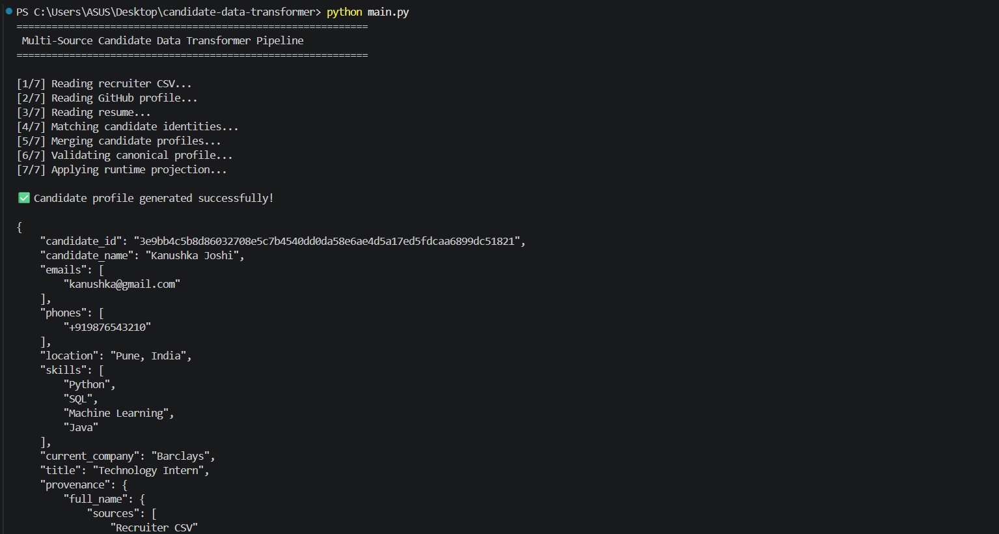
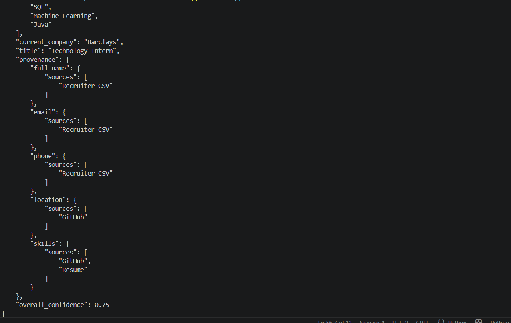

# Multi-Source Candidate Data Transformer

A Python-based data transformation pipeline developed as part of the **Eightfold Engineering Internship Assignment**.

The application ingests candidate information from multiple heterogeneous sources, normalizes inconsistent data, resolves conflicts using a deterministic merge strategy, validates the final profile, and generates a configurable canonical candidate profile with provenance tracking.

The pipeline is deterministic, modular, and configurable, ensuring the same input always produces the same canonical output.

---

# Features

- Parse candidate information from multiple sources
  - Recruiter CSV
  - GitHub JSON
  - Resume Text
- Normalize candidate information
  - Email
  - Phone Number (E.164 format using custom normalization logic)
  - Name
  - Skills
- Identity Matching
- Conflict Resolution
- Canonical Candidate Profile Generation
- Provenance Tracking
- Confidence Scoring
- Runtime Configurable Output Projection
- Schema Validation

---

# Project Structure

```text
candidate-data-transformer/
├── assets/
│   ├── pipeline-run.png
│   └── output-json.png
│
├── input/
│   ├── recruiter.csv
│   ├── github.json
│   └── resume.txt
│
├── modules/
│   ├── parser.py
│   ├── normalizer.py
│   ├── merger.py
│   ├── projector.py
│   └── validator.py
│
├── output/
│   └── candidate.json
│
├── tests/
│   └── README.md
│
├── config.json
├── main.py
├── README.md
├── requirements.txt
└── .gitignore
```

---

# Pipeline Architecture

```text
Input Sources
      │
      ▼
Parser
      │
      ▼
Normalization
      │
      ▼
Identity Matching
      │
      ▼
Conflict Resolution
      │
      ▼
Canonical Profile Generation
      │
      ▼
Validation
      │
      ▼
Projection Layer
      │
      ▼
Output JSON
```

---

## Design Principles

- Modular Architecture
- Deterministic Processing
- Explainable Merge Decisions
- Configurable Output
- Robust Error Handling

---

# Merge Strategy

Candidate records are merged using the following priority:

1. Normalized Email
2. Phone Number
3. Full Name + Current Company

### Conflict Resolution Policy

- Structured recruiter data is preferred when conflicts occur.
- Missing values are preserved rather than inferred.
- Skills from GitHub and Resume are combined and deduplicated.
- Every selected field records its provenance.

---

# Normalization

The pipeline standardizes candidate information before merging.

| Raw Value | Normalized Value |
|-----------|------------------|
| Kanushka@GMAIL.COM | kanushka@gmail.com |
| 98765-43210 | +919876543210 |
| python | Python |
| PYTHON | Python |
| kanushka joshi | Kanushka Joshi |

---

# Canonical Schema

The internal canonical profile contains:

- candidate_id
- full_name
- emails
- phones
- location
- skills
- current_company
- title
- provenance
- overall_confidence

---

# Runtime Configurable Projection

The application separates the **internal canonical schema** from the **external output schema**.

Internally, the canonical profile stores:

```python
full_name
```

The output field names are controlled through `config.json`.

Example:

```json
{
  "rename": {
    "full_name": "candidate_name"
  }
}
```

Without modifying any Python code, the generated output becomes:

```json
{
  "candidate_name": "Kanushka Joshi"
}
```

This keeps the business logic independent of client-specific output requirements.

---

# Provenance Tracking

Every selected field stores the source from which it was derived.

Example:

```json
"provenance": {
  "email": {
    "sources": [
      "Recruiter CSV"
    ]
  },
  "skills": {
    "sources": [
      "GitHub",
      "Resume"
    ]
  }
}
```

This improves traceability and makes merge decisions transparent.

---

# Confidence Scoring

Source reliability scores used by the pipeline:

| Source | Score |
|--------|------:|
| Recruiter CSV | 0.90 |
| GitHub | 0.75 |
| Resume | 0.60 |

The overall confidence score is calculated from the sources contributing to the final candidate profile.

---

# Example Transformation

## Input

### Recruiter CSV

```text
Email   : Kanushka@GMAIL.COM
Phone   : 98765-43210
Company : Eightfold
```

### GitHub

```text
Name   : kanushka joshi
Skills : python, SQL, Machine Learning
```

### Resume

```text
Skills

PYTHON
Machine Learning
Java
```

---

## Output

```text
Candidate Name : Kanushka Joshi
Email          : kanushka@gmail.com
Phone          : +919876543210
Skills         : Python, SQL, Java, Machine Learning
```

---

# How to Run

Clone the repository:

```bash
git clone https://github.com/kanushkajoshi/candidate-data-transformer.git
```

Move into the project directory:

```bash
cd candidate-data-transformer
```

Run the application:

```bash
python main.py
```

The pipeline will:

- Parse candidate data from all input sources
- Normalize inconsistent values
- Match candidate identities
- Merge records into a canonical profile
- Validate the output schema
- Generate `output/candidate.json`

The generated canonical profile is saved in:

```text
output/candidate.json
```

---

# Demo

### Pipeline Execution



### Generated Canonical Profile



---

# Design Decisions

- A modular architecture separates parsing, normalization, merging, validation, and projection.
- Normalization is performed before merging to eliminate inconsistencies.
- Identity matching is completed before merging to prevent unrelated records from being combined.
- The canonical schema remains independent of client-specific output formats.
- The projection layer uses configuration instead of code changes to customize output.
- Provenance is maintained for every merged field to improve traceability.
- Missing values are preserved rather than inferred.

---

# Assumptions

- One canonical profile is generated per candidate.
- Email is the preferred identity key.
- Resume text contains identifiable section headings.
- Input files follow the expected sample formats.

---

# Future Improvements

- Support PDF and DOCX resume parsing.
- Fuzzy identity matching using similarity metrics.
- Field-level confidence scoring.
- Database-backed candidate storage.
- REST API for profile transformation.
- Support additional candidate data sources.
- Comprehensive unit and integration tests.

---

# Author

**Kanushka Joshi**

---

This project was developed as part of the Eightfold Engineering Internship Assignment and demonstrates a modular, configurable, and explainable approach to transforming heterogeneous candidate data into a unified canonical profile.